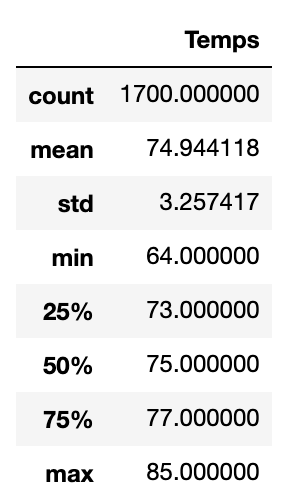
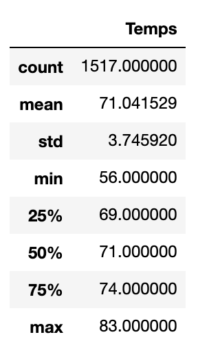

# Surfs_up

## Overview of the statistical analysis

The purpose of the analysis is analyze temperature trends before opening the surf shop & ice cream store in Oahu. We analyzed the temperature data for the months of June and December in Oahu, in order to determine if the surf and ice cream shop business is sustainable year-round.

## Results

### Results for June:

### Results for December:

### Analysis for June and December
* The average temperature in December is 71.0F which is 4 degrees lower than in June which is 74.9F.
* The minumum temperature for December is 56.0F while the minimum in June is 64.0F.
* The maximum temperature in December is 83.0F while the maximum in June is 85.0F.
* The total number of observations for December was 1517 which is 183 fewer than in June. This may have an impact on the results.

## Summary:
As per the analysis, the maximum temperature in December is 83.0F while the maximum in June is 85.0F. This shows that there will most likely be days in every month of the year that are warm enough to attract customers to surf and ice cream shop. The minumum temperature for December is 56.0F while the minimum in June is 64.0F shows that there could be days where the surf and ice cream shop may not be attractive to the consumers. The average temperature in December is 71.0F and in June is 74.9F which shows that on an average, Oahu is warm all year round which shows good market entry for this kind of business.

To further analyze the weather conditions, we could run these analyses for every month and plot the statistics using Matplotlib to get a better visual of the weather patterns. We could also perform similar analysis on the precipitation measurements as this will further analyze the weather conditions that may impact incentive to surf or buy ice cream.

## Software

1. Jupyter notebook
2. SQLite
